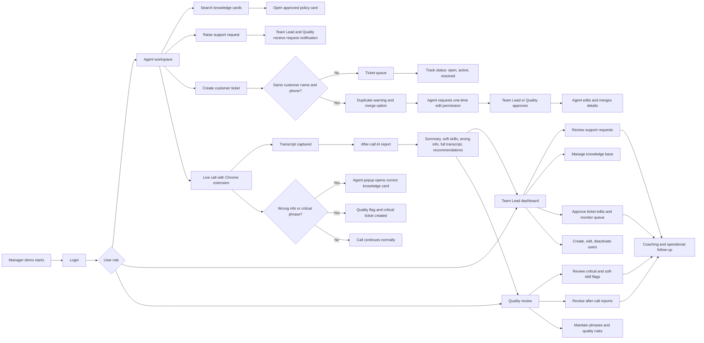

# AquaDesk Presentation Flow

Use this as a FigJam/Figma-ready flow for presenting the web app. The Mermaid diagram can be pasted into FigJam using a Mermaid/diagram widget, or recreated as frames in Figma.

## Main Demo Flow

## Presenter Story

1. Start with login and role-based access.
   - Agents, Team Lead, and Quality see different workspaces.
   - Team Lead controls users, tickets, support requests, and knowledge setup.

2. Show the agent workspace.
   - Agent searches approved knowledge cards.
   - Agent can raise a support request while working with a customer.
   - Team Lead and Quality receive the request and can follow up.

3. Show ticket creation and duplicate protection.
   - Agent creates a customer ticket with mandatory fields.
   - If same customer name and phone already exist, the app warns about a duplicate.
   - Agent can open the existing ticket or request one-time edit permission to merge details.

4. Show the live call extension.
   - Extension captures transcript during a Maqsam/live call.
   - If wrong information or a critical phrase is detected, the agent receives a popup.
   - The popup opens the correct knowledge card so the agent can correct the answer during the call.

5. Show after-call reporting.
   - After the call, AI creates a report.
   - Report includes summary, soft skills, wrong info, full transcript, and recommendations.
   - Team Lead and Quality use the report for coaching and QA follow-up.

6. Close with the management loop.
   - Knowledge cards, phrase rules, user access, tickets, and coaching all stay connected.
   - The system turns live calls into tracked actions, QA signals, and manager visibility.

## Figma Frame Suggestions

- Frame 1: Login and role split
- Frame 2: Agent workspace and knowledge search
- Frame 3: Live call extension popup
- Frame 4: Ticket creation, duplicate warning, one-time edit approval
- Frame 5: Team Lead dashboard
- Frame 6: Quality review and after-call report
- Frame 7: End-to-end operational loop

## Demo Script

"AquaDesk connects the agent workflow, live-call guidance, ticket handling, and quality review in one system. The agent works from approved knowledge cards and creates tickets with duplicate protection. During live calls, the extension captures transcript text and can warn the agent when wrong information is given, opening the right knowledge card immediately. After the call, the transcript is analyzed into a full report for Team Lead and Quality, including wrong info, soft-skill findings, and recommendations. Team Lead can manage users, knowledge, support requests, tickets, and coaching from the same operational view."
